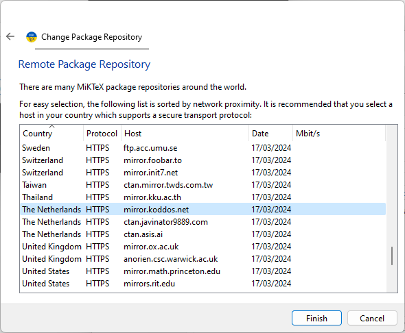

# MikTeX

[MikTeX](https://miktex.org) is wellicht de oudste en bekendste LaTeX-distributie voor Windows. MikTeX heeft een ingebouwde package manager die automatisch ontbrekende packages installeert. Op die manier kan de initiële installatie relatief klein gehouden worden.

## Installatie

We raden aan om een package manager te gebruiken om software te installeren op Windows ([Winget](https://learn.microsoft.com/en-us/windows/package-manager/winget/)). Indien je dit toch niet wenst te doen, dan kan je het downloaden via de website: <https://miktex.org/download>. Open een terminal **als Administrator** en voer uit:

```console
> winget install  MiKTeX.MiKTeX
Found MiKTeX [MiKTeX.MiKTeX] Version 24.1
This application is licensed to you by its owner.
Microsoft is not responsible for, nor does it grant any licenses to, third-party packages.
Downloading https://miktex.org/download/ctan/systems/win32/miktex/setup/windows-x64/basic-miktex-24.1-x64.exe
  ██████████████████████████████   138 MB /  138 MB
Successfully verified installer hash
Starting package install...
Successfully installed
```

## Eerste gebruik: updates installeren

Na installatie is het belangrijk om de [MikTeX-console](https://miktex.org/howto/miktex-console) te openen en de instructies daar te volgen. Je krijgt een melding dat er nog niet gecontroleerd is op updates. Als je dit niet doet, dan zal het compileren van een LaTeX-document ook niet lukken.


Klik "Switch to MiKTeX administrator mode" en vervolgens op "Check for updates".


Als er updates zijn, klik dan in het menu links op Updates en installeer deze.


## Installatie van ontbrekende packages

Wanneer je in TeXStudio, VSCode of een andere editor/IDE een LaTeX-document compileert, kan MikTeX aanbieden om ontbrekende packages te installeren. Je ziet dan volgend dialoogvenster:


MikTeX heeft immers niet *alle* packages geïnstalleerd (dat zou verschillende GB aan schijfruimte innemen), enkel de meest courante.

Onderaan kan je het vinkje weghalen om MikTeX niet meer te vragen om ontbrekende packages te installeren.


## Configuratie

In de MikTeX-console kan je eventueel nog wijzigen van welke package repository mirror ([CTAN](https://ctan.org) - the Comprehensive TeX Archive Network) je packages wil downloaden. Standaard staat deze op "&lt;Random package repository on the internet&gt;", maar je kan een specifieke repository kiezen die geografisch dichterbij is, zodat het installeren van packages en updates sneller kan gaan.

Ga naar Settings en klik op Change... bij "Package installation":


Selecteer in het dialoogvenster "Remote package repository (Internet)" en vevolgens "Next". **Let op:** als je de knoppen "Next" en "Cancel" niet ziet staan, vergroot dan het dialoogvenster.


Uit de lijst kan je nu een mirror kiezen. Er zijn er blijkbaar geen beschikbaar in België zelf, dus kies een van onze buurlanden.



Klik vervolgens op "Finish".

Verifieer dat de nieuwe mirror geselecteerd is.

Voor de keuze "You can choose whether missing packages are to be installed automatically (on-the-fly)" kan je "Always" selecteren. Dit zorgt ervoor dat MikTeX automatisch ontbrekende packages installeert wanneer je een LaTeX-document compileert en vermijdt het dialoogvenster dat we hierboven zagen.

