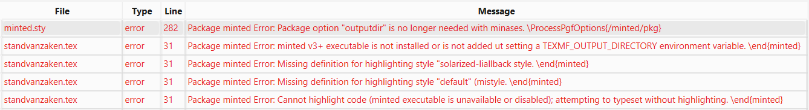
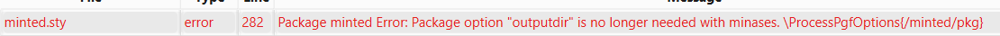

# minted

De package `minted` laat toe om codefragmenten op te maken met syntaxkleuren zoals die in een code-editor of IDE getoond worden. Het resultaat ziet er een stuk beter uit dan de klassieke `lstlisting`-omgeving, die eerder ontworpen is voor het afdrukken van een document op papier en in zwart-wit.

Het nadeel van `minted` is wel dat het iets meer moeite vraagt om het te installeren, want het maakt gebruik van de Python-package `pygments`. Deze moet je dus eerst installeren.

## Installatie

Als je nog geen Python-omgeving hebt, installeer dit dan eerst. Vervolgens moet je nog Pip-packages `pygments` en `latexminted` installeren. Zorg er voor dat je LaTeX-editor of IDE niet geopend is tijdens deze stappen, anders kan het zijn dat de packages niet gevonden worden.


=== "Windows"

    ```console
    > winget install -e --id Python.Python
    > pip install pygments latexminted
    ```

=== "Debian/Ubuntu/Fedora"

    Als je de instructies voor de installatie van [TeXlive](./installatie-texlive.md) gevolgd hebt, dan is ook de Python-package voor minted geïnstalleerd.

    Als je bij de compilatie van een LaTeX-document een fout krijgt die lijkt op `latexminted: command not found`, dan installeer je die nog via `pip`:  `pip install latexminted`.

## Gebruik

Om `minted` te gebruiken, moet je de package laden in de preamble van je document. In het voorbeeld hieronder zorgt de optie `chapter` er voor dat de nummering van de codefragmenten per hoofdstuk gebeurt.

```latex
\usepackage[chapter]{minted}
```

In het sjabloon voor de bachelorproef is hier al [code voor voorzien](https://github.com/HoGentTIN/latex-hogent-bachproef/blob/main/bachproef/FamilienaamVoornaamBP.tex#L19).

**Let op!** Als je MikTeX op Windows gebruikt, moet je lijn 21 (zoals het voorbeeld hierboven) uit commentaar halen en lijn 24 (waar ook de optie `outputdir=../output` staat) in commentaar zetten. De reden is dat de nieuwste versie van `minted`, die beschikbaar is in MikTeX, de optie `outputdir` niet meer nodig heeft.

Als je het script `make_thesis.{bat,sh}` gebruikt om je bachelorproef te genereren (m.h.v. een Docker-container), dan is de optie `outputdir` wél nodig. In dat geval moet dus lijn 21 in commentaar staan en lijn 24 uit commentaar.

## Problemen

Als je problemen hebt bij het gebruik van `minted`, kan je hopelijk hier een oplossing vinden...

### Executable is not installed



Of een foutboodschap zoals:

> latexminted' is not recognized as an internal or external command, operable program or batch file. Process exited with error(s)

**Oplossing:** Zorg dat alle nodige packages geïnstalleerd zijn, meer bepaald de Python packages `pygments` en `latexminted`. Zie hierboven onder [Installatie](#installatie).

### Package option "outputdir" is no longer needed.



**Oplossing:** Bij het laden van de package `minted` verwijder je de optie `outputdir` zodat je het volgende overhoudt:

```latex
\usepackage[chapter]{minted}
```
