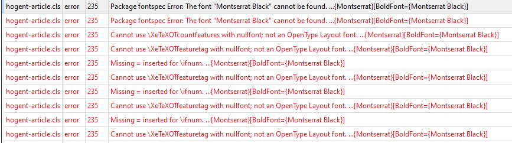
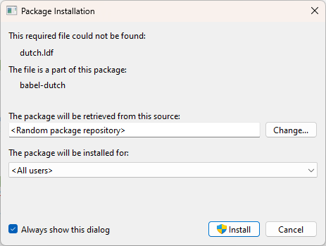
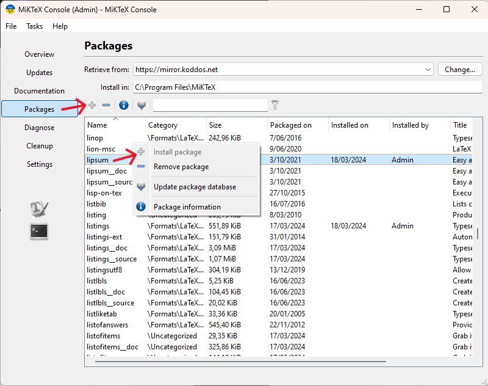
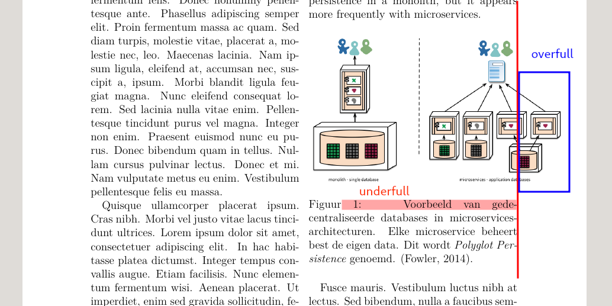

# Vaak voorkomende problemen

## Font niet gevonden



Als je in de foutboodschap een van de volgende fonts ziet: Montserrat, Fira Code, Fira Math, Code Pro Black, dan heb je de lettertypes die bij de HOGENT-huisstijl horen nog niet (correct) geïnstalleerd. Zie [Lettertypes](hogent-huisstijl.md#lettertypes) voor instructies.

## Ontbrekende packages

Als je bij compilatie in TeXStudio of VSCode op Windows het volgende ziet:



klik dan onderaan "Always show dis dialog" UIT en klik op "Install". Zie ook [MikTeX installatie](installatie-miktex.md#installatie-van-ontbrekende-packages).

Als je de foutboodschap ziet in het Messages-paneel onderaan, bv.:

```plaintext
! LaTeX Error: File `lipsum.sty' not found.
```

dan is er ofwel iets misgelopen bij de installatie, ofwel heb je MikTeX niet toegelaten packages automatisch te installeren. Open de MikTeX Console, ga naar "Packages", zoek de ontbrekende package in de lijst en klik op de installeerknop (plus-icoon).



Je kan MikTeX instellen dat packages automatisch geïnstalleerd worden. Zie [MikTeX installatie](installatie-miktex.md#installatie-van-ontbrekende-packages).

## Overfull/underfull hbox

Eén van de vaakst voorkomende waarschuwingen bij het compileren van LaTeX-documenten is "Overfull/Underfull hbox". Dit betekent dat LaTeX er niet in slaagt om de tekst of afbeeldingen zo te plaatsen dat je een mooie rechtermarge krijgt.



In dit voorbeeld veroorzaakt de afbeelding een "overfull hbox" omdat de afbeelding te breed is om binnen de marges te passen. Dit kan je oplossen door de afbeelding te schalen, bv. `\includegraphics[width=\textwidth]{afbeelding.png}`.

In het bijschrift zie je veel witruimte tussen de woorden, wat wijst op een "underfull hbox". In dit geval is de oorzaak het woord `microservices-architectuur` even verderop. In dit geval kan je dat oplossen door LaTeX zelf te helpen met het [splitsen van woorden](#splitsen-van-woorden).

Merk op dat het hier gaat om een waarschuwing en geen foutboodschap. Bekijk zeker de PDF om te kijken of de layout nog netjes is, en pas aan waar nodig. Maar als de layout ok is, hoef je niet noodzakelijk de waarschuwingen op te lossen.

## Splitsen van woorden

In normale omstandigheden is LaTeX slim genoeg om woorden correct te splitsen volgens de Nederlandstalige regels. Jammer genoeg wordt deze functionaliteit uitgeschakeld bij woorden met een koppelteken (`-`), bijvoor beeld `microservices-architectuur`. LaTeX zal dit woord enkel nog splitsen aan het koppelteken, waardoor het woord ofwel door de rechtermarge gaat, ofwel op de volgende regel gezet wordt maar met te veel witruimte tussen de woorden. Je krijgt dan bovendien een "[Overfull/Underfull hbox](#overfullunderfull-hbox)" waarschuwing.

Je moet in dat geval LaTeX helpen door zelf aan te geven waar een woord mag gesplitst worden met `\-`. Bijvoorbeeld: `mi\-cro\-ser-\vi-\ces-ar\-chi\-tec\-tuur`.

